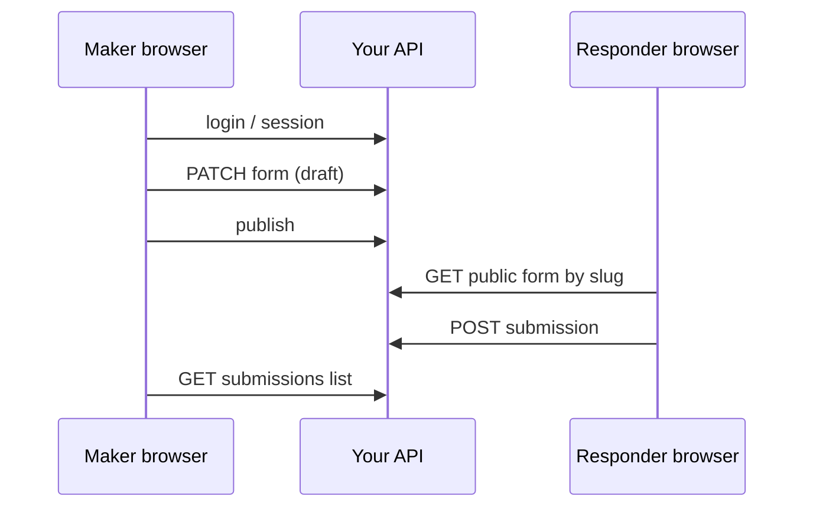

# Formvity — Backend API catalog & implementation guide

**Start here:** [Which APIs to build first](#which-apis-to-build-first) — numbered steps **1 → 15** (core loop first, auth next, **Spring Security last**).

This document also lists **all endpoints**, explains **why / where** they are used, and includes a longer Spring Boot guide below.

**Actors**

- **Form maker** (authenticated): dashboard, builder, publish, responses inbox.
- **Responder** (public): share link → optional intake → form → submit.
- **Developer / internal**: JSON QA is not the responder product; public `GET` returns a **sanitized** PageDef.

The current UI repo is **frontend-only**; these endpoints replace `localStorage`. Product flows: [README-USER-FEATURES.md](./README-USER-FEATURES.md).

**Conventions**

- Paths are **illustrative** (`:workspaceId`, `:formId`, `:slug`). Align with your router.
- **Auth** (pick one per deployment; the Formvity SPA is wired for **server session + cookie** in the basic integration):
  - **Session (cookie)**: browser sends `Cookie` on same-site requests; SPA uses `fetch(..., { credentials: "include" })`. Typical cookie names: `JSESSIONID` (Spring), or a custom session id. **HttpOnly** + **Secure** (prod) + **SameSite=Lax** (or `Strict` if you never need cross-site top-level navigations).
  - **Bearer JWT**: `Authorization: Bearer <accessToken>` for APIs that do not rely on cookies.
- Endpoints marked **Public** are unauthenticated (still rate-limit). All other maker routes require an **authenticated session** (or Bearer, if you switch).
- Prefer **JSON** bodies and **cursor-based pagination** for lists.

---

<a id="session-api-by-category"></a>

## Session authentication — API grouped by category

This block is the **contract** for the **session-based** auth layer. It complements the long-form tables in [§4](#4-authentication-and-session)–[§7](#7-forms-pagedef-crud). Grouping matches how you document in OpenAPI / Postman collections.

### Category A — Platform & health

| Method | Path | Auth | Description |
|--------|------|------|-------------|
| `GET` | `/internal/health` | Internal / public | Liveness for probes and deploy smoke tests. |

### Category B — Authentication & session

| Method | Path | Auth | Description |
|--------|------|------|-------------|
| `POST` | `/auth/register` | **Public** | Create account. Body typically `{ "email", "password", "name", "company?" }`. **201** + optional user summary; establishes session **or** returns credentials per your policy (prefer: **set-session cookie** on success). |
| `POST` | `/auth/login` | **Public** | Validate credentials; **200** on success. Server issues **session cookie** (`Set-Cookie`). Body `{ "email", "password" }`. Rate-limit and lockout policy apply. |
| `POST` | `/auth/logout` | **User** | Invalidate server session and clear cookie (`Set-Cookie` with empty / max-age=0). **204** or **200** with empty body. |
| `GET` | `/auth/session` | **User** (optional) | Lightweight **200** if session is valid (optional heartbeat for SPA). **401** if expired. |

**Session semantics (backend must)**

- After successful **login** or **register**, return `Set-Cookie` for the session; do **not** put refresh tokens in `localStorage` for cookie-based flows.
- **Logout** must destroy server-side session state (not only delete cookie client-side).
- On **401** for maker routes, SPA should redirect to `/login` (or `/register` for first-time funnel).

**CSRF (Spring Security / cookie sessions)**

- If CSRF is enabled for state-changing requests, expose a token the SPA can read (e.g. Spring Security’s CSRF cookie/header pattern) and require it on `POST`/`PATCH`/`DELETE` to `/auth/*` and `/workspaces/**` as configured.
- Document the exact header name (often `X-XSRF-TOKEN` paired with cookie `XSRF-TOKEN`) in your OpenAPI `securitySchemes`.

### Category C — Current user (session-bound)

| Method | Path | Auth | Description |
|--------|------|------|-------------|
| `GET` | `/me` | **User** | Returns `{ id, email, name, defaultWorkspaceId?, … }` for the **current session**. **401** if not logged in. |
| `PATCH` | `/me` | **User** | Update profile fields allowed by policy (e.g. name, avatar URL). |

### Category D — Workspaces (tenancy)

See [§6 Workspaces](#6-workspaces-tenancy). All listed `GET`/`POST`/`PATCH`/`DELETE` paths under `/workspaces/**` require **session** (or Bearer) except explicitly public invite URLs.

### Category E — Forms (PageDef)

See [§7 Forms](#7-forms-pagedef-crud). Authenticated editor/member routes; definition is JSON (**PageDef**).

### Category F — Publishing & public runtime

See [§8 Publishing and public runtime](#8-publishing-and-public-runtime). **`GET /public/forms/:slug`** stays **Public** (no session).

### Category G — Submissions

See [§9 Submissions](#9-submissions). **`POST /public/forms/:slug/submissions`** is **Public**; inbox/list endpoints are **User**.

### Category H — Password recovery & SSO (optional, later)

See [§4](#4-authentication-and-session) rows for `/auth/password/*`, `/auth/providers`, `/auth/sso/*`. Not required for the **basic session** MVP.

---

## Which APIs to build first

Use this **strict order**. Do not skip ahead: each step should work in Postman (or tests) before you start the next.

Until **step 11**, treat the maker as a **dev stub** (fixed `workspaceId`, `permitAll` on maker routes, or `X-Dev-User-Id` header). **Do not** spend time on Spring Security JWT until the public + maker loop works.

| Step | API | What “done” looks like |
|------|-----|-------------------------|
| **1** | `GET /internal/health` | 200 OK from your deploy / local run. |
| **2** | `POST /workspaces` + `GET /workspaces` | You have a real `workspaceId` (or seed one row in SQL and skip POST until users exist). |
| **3** | `POST /workspaces/:workspaceId/forms` | Creates a row; returns `formId` (new empty form). |
| **4** | `GET /workspaces/:workspaceId/forms` | Returns a list (even one item) for the future dashboard. |
| **5** | `GET /workspaces/:workspaceId/forms/:formId` | Returns full **PageDef** JSON for the builder to load. |
| **6** | `PATCH /workspaces/:workspaceId/forms/:formId` | Saving draft JSON updates DB; reload GET shows changes. |
| **7** | `POST /workspaces/:workspaceId/forms/:formId/publish` | Draft copied to **published** storage; **slug** exists and is unique. |
| **8** | `GET /public/forms/:slug` | Anonymous read returns **sanitized** published JSON; 404 if not published. |
| **9** | `POST /public/forms/:slug/submissions` | Body `{ respondent, answers }` validated and **persisted**; 201 + id. |
| **10** | `GET /workspaces/:workspaceId/forms/:formId/submissions` | Paginated list includes the row from step 9. |
| **11** | `GET /workspaces/:workspaceId/forms/:formId/submissions/:submissionId` | Full detail for inbox drill-down. |

**Then wire real accounts (before or with Spring Security):**

| Step | API |
|------|-----|
| **12** | `POST /auth/register` |
| **13** | `POST /auth/login` |
| **14** | `GET /me` |

**Last:**

| Step | Work |
|------|------|
| **15** | **Spring Security** — authenticate `/workspaces/**` and `/me`; **permitAll** on `/public/**`, `/auth/register`, `/auth/login`; CORS for your SPA. |

**Only after 1–15:** `POST /auth/refresh`, `POST /auth/logout`, `GET …/publish-status`, CSV export, `POST …/forms` with `{ templateId }`, file uploads, webhooks, analytics (see endpoint sections **§4–§19** below).

**Note:** `GET /internal/health` is listed under [§16 Admin](#16-admin-and-support) in the reference tables; build it first anyway (step **1**).

---

## Table of contents

**Build order:** [Which APIs to build first](#which-apis-to-build-first)

**Database:** [README-DATABASE-SCHEMA.md](./README-DATABASE-SCHEMA.md) (tables + fields + DDL sketch)

**Session auth (by category):** [Session API catalog](#session-api-by-category)

1. [Getting started — comprehensive guide](#1-getting-started--comprehensive-guide) (Spring Security **last**)
2. [Minimal MVP set](#2-minimal-mvp-set)
3. [Why each API exists and where to call it](#3-why-each-api-exists-and-where-to-call-it)
4. [Authentication and session](#4-authentication-and-session)
5. [Users and profile](#5-users-and-profile)
6. [Workspaces (tenancy)](#6-workspaces-tenancy)
7. [Forms (PageDef CRUD)](#7-forms-pagedef-crud)
8. [Publishing and public runtime](#8-publishing-and-public-runtime)
9. [Submissions](#9-submissions)
10. [Templates (optional server catalog)](#10-templates-optional-server-catalog)
11. [File uploads](#11-file-uploads)
12. [Webhooks and outbound integrations](#12-webhooks-and-outbound-integrations)
13. [Integrations configuration (inbound)](#13-integrations-configuration-inbound)
14. [Analytics and events](#14-analytics-and-events)
15. [Anti-abuse and platform](#15-anti-abuse-and-platform)
16. [Admin and support](#16-admin-and-support)
17. [Non-HTTP infrastructure](#17-non-http-infrastructure)
18. [Security: PageDef actions and code execution](#18-security-pagedef-actions-and-code-execution)
19. [Related docs](#19-related-docs)

---

## 1. Getting started — comprehensive guide

The **canonical implementation order** is the numbered table in [Which APIs to build first](#which-apis-to-build-first) (steps **1 → 15**). This section adds **Spring Boot** detail and a phase lens; it does not replace that order.

Use this if you are building a **Spring Boot** (or similar) API from zero. The idea is to **prove domain behavior first**, then **lock down with Spring Security** so you are not fighting filters and CORS while you still change DTOs daily.

### 1.1 Prerequisites

- **JDK 21** (or 17 LTS) + **Spring Boot 3.x** project (`spring-boot-starter-web`, `spring-boot-starter-data-jpa` or JDBC, `spring-boot-starter-validation`).
- **PostgreSQL** (recommended) for relational data: users, workspaces, forms, published snapshots, submissions.
- **OpenAPI** optional but useful (`springdoc-openapi`) for contract tests with the React app.
- This repo’s **PageDef** JSON as the document you persist (text/JSONB column or normalized—your choice for v1 JSONB is fine).

### 1.2 Two HTTP “surfaces” from day one

| Surface | Example path prefix | Who calls it |
|---------|---------------------|--------------|
| **Maker API** | `/workspaces/{id}/...` | Authenticated SPA (later); during dev, Postman/curl |
| **Public API** | `/public/forms/{slug}` | Responder page, no login |

Keep controllers in **separate packages** (`...api.maker`, `...api.public`) so when you add Spring Security you can write: `authorizeHttpRequests(r -> r.requestMatchers("/public/**").permitAll()...)`.

### 1.3 Phase plan (Spring Security **last**)

Rough map to [Which APIs to build first](#which-apis-to-build-first): phases **0–1** → steps **1–2** (+ DB); **2–4** → steps **3–8**; **5–6** → steps **9–11**; **LAST** → steps **12–15**.

| Phase | Goal | Spring Security |
|-------|------|-----------------|
| **0** | Empty app runs; `GET /internal/health` returns OK. | **None** or single `permitAll()` for everything (dev only). |
| **1** | JPA entities + Flyway/Liquibase: `User`, `Workspace` (1 per user OK), `Form` (draft JSON), optional `PublishedSnapshot` (slug + JSON + version). | Still **permitAll** for maker routes, or a fixed `X-Dev-User-Id` header your service reads—**no** JWT yet. |
| **2** | `GET /public/forms/:slug` reads **published** JSON; 404 if unpublished. | `permitAll` for `/public/**` only; maker routes still open **or** dev header. |
| **3** | `POST/PATCH/GET …/forms` CRUD: create list, load builder doc, save draft. | Same: identify “maker” via dev stub. |
| **4** | `POST …/publish`: copy draft → published row, assign `slug`, uniqueness check. | Same. |
| **5** | `POST /public/.../submissions`: validate `respondent` + `answers` against published definition; persist `Submission`. | Rate limit can start as **simple** (bucket in DB/Redis) before full edge rules. |
| **6** | `GET …/submissions` + by id for inbox UI. | Maker identification still stub until Phase LAST. |
| **7** | Nice-to-haves: CSV export, `GET /templates`, webhooks via `@Async` or queue. | Optional: restrict `/admin/**` with HTTP Basic **only** on a management port (still not full app JWT). |
| **LAST** | **Spring Security production**: `SecurityFilterChain` with **stateless JWT** (or session cookies), **CORS** for your SPA origin, **`/public/**` permitAll**, **`/auth/**` permitAll** for login/register, **authenticated** matcher for `/workspaces/**`, **`/me`**, password hashing (`BCryptPasswordEncoder`), optional **method security** `@PreAuthorize` on workspace role, **CSRF** disabled only for stateless JWT APIs (document tradeoff). Replace dev header with real `Authentication` principal. | This is when you delete `permitAll` on maker paths and wire `JwtAuthenticationFilter` (or OAuth2 Resource Server). |

**Why Spring Security last:** your controllers, validation rules, and DB schema will churn. Early Security means every 401 blocks frontend integration. Once `POST /submissions` and `GET …/forms` behave correctly, securing them is mostly configuration + token issuance.

### 1.4 Spring Boot specifics (non-security)

- **DTOs + `@Valid`** for request bodies; map to entities in a service layer.
- **`@ControllerAdvice`** for consistent error JSON (`problem+json` or simple `{ "message", "code" }`).
- **Transaction boundaries** on publish + submit (single `@Transactional` service methods).
- **Idempotency** (optional): `Idempotency-Key` header on submit for double-clicks.

### 1.5 When you finally add Spring Security (Phase LAST)

1. Add **`spring-boot-starter-security`** (and **`spring-boot-starter-oauth2-resource-server`** if JWT).
2. Define a **`SecurityFilterChain`** bean: public routes, auth routes, then `anyRequest().authenticated()`.
3. Implement **`UserDetailsService`** (or custom `AuthenticationProvider`) backed by your `User` table.
4. Issue **JWT** on login (`/auth/login`) or use **session** for same-site SPA—pick one and stick to it.
5. **CORS**: allow credentials only if you use cookies; for Bearer JWT, configure allowed origins/methods/headers for your Vite dev server + prod app URL.
6. **Integration test** with `@SpringBootTest` + `MockMvc` and `@WithMockUser` for maker routes; `MockMvc` without auth for `/public/**`.

### 1.6 Wiring the React app (when ready)

- **Session (cookie) — maker app:** call login/register/logout and all maker APIs with `fetch(url, { credentials: "include", … })` so the browser sends the session cookie. After navigation, call **`GET /me`** to hydrate user state. On **401**, redirect to `/login`.
- **Bearer JWT — maker app:** send `Authorization: Bearer <accessToken>` from login response; store access token in memory (avoid `localStorage` unless you accept XSS risk); implement refresh via `/auth/refresh` if you use refresh tokens.
- **Responder app:** **no** maker session required; only `GET` + `POST` public endpoints; CAPTCHA token in body if used.

---

## 2. Minimal MVP set

**Order to implement:** follow [Which APIs to build first](#which-apis-to-build-first) (steps **1 → 15**). The table below is a **capability checklist**, not the sequence to code in (e.g. auth rows appear before forms in the table, but you build **forms + public + submissions** first with a dev stub).

Smallest backend that supports **login → my forms → create (template or scratch) → publish link → responder (intake + form) → maker sees responses**.

Assume `workspaceId` is implicit (single workspace per user) or resolved server-side from `GET /me` to keep paths short in v1.

| Method | Path | Auth | Purpose |
|--------|------|------|---------|
| `POST` | `/auth/register` | Public | Sign up |
| `POST` | `/auth/login` | Public | Session / tokens |
| `POST` | `/auth/logout` | User | End session |
| `GET` | `/me` | User | Profile + default workspace |
| `GET` | `/workspaces/:workspaceId/forms` | Member | **Dashboard:** list maker’s forms |
| `POST` | `/workspaces/:workspaceId/forms` | Editor | **New:** empty body or `{ templateId }` → new owned `formId` |
| `GET` | `/workspaces/:workspaceId/forms/:formId` | Member | Load **PageDef** (+ settings such as intake config) for builder |
| `PATCH` | `/workspaces/:workspaceId/forms/:formId` | Editor | Save draft definition + settings |
| `POST` | `/workspaces/:workspaceId/forms/:formId/publish` | Editor | Publish / update public slug |
| `GET` | `/public/forms/:slug` | **Public** | Sanitized definition for **responder** runtime (no secrets) |
| `POST` | `/public/forms/:slug/submissions` | **Public** | Body includes **`respondent`** (intake) + **`answers`** (form fields); rate-limited |
| `GET` | `/workspaces/:workspaceId/forms/:formId/submissions` | Member | **Inbox:** paginated list |
| `GET` | `/workspaces/:workspaceId/forms/:formId/submissions/:submissionId` | Member | Full row: intake + answers + metadata |

**Optional v1:** `POST /auth/refresh`, `GET …/submissions/export?format=csv`, CAPTCHA verify inside submit or separate token endpoint.

Single-user startups can collapse `workspaceId` to a default workspace created on registration.

---

## 3. Why each API exists and where to call it

Use this while implementing controllers **and** React routes. For each block: **Why** = product/security reason; **Where** = screen or trigger; **Backend must** = non-negotiable server behavior.

**Two clients**

| Client | Example host | Calls mostly |
|--------|--------------|--------------|
| **Maker SPA** | `app.formvity.com` | Auth, `GET /me`, `GET …/forms`, `PATCH …/forms/:id`, `POST …/publish`, `GET …/submissions` |
| **Responder** | `forms.formvity.com` / `/r/:slug` | `GET /public/forms/:slug`, `POST …/submissions`, optional uploads + analytics |

Same **PageDef** shape; **public GET** returns **sanitized** JSON only.



### 3.1 Authentication and session

**Why:** Maker routes must be tied to an identity (ownership, billing).

**Where:** Register/login pages; logout in header; refresh in HTTP interceptor on 401; password reset flows; SSO redirects.

**Backend must:** Hash passwords, throttle logins, issue tokens or secure sessions.

### 3.2 Current user (`/me`)

**Why:** Client needs **user id** and **default workspace id** to prefix requests.

**Where:** App shell after auth—once on load, cache in context.

**Backend must:** Resolve user from token/session; never trust client `userId` for authorization.

### 3.3 Workspaces and members

**Why:** Shared forms, roles, billing container. Solo: auto-create one workspace per user.

**Where:** Workspace switcher, org settings, team invites.

**Backend must:** Membership check on every `…/workspaces/:workspaceId/...` call.

### 3.4 Forms (CRUD)

**Why:** Persist **PageDef**; builder is only in-memory until saved.

**Where:** Dashboard list (`GET …/forms`); new form / template fork (`POST`); builder mount (`GET`); autosave (`PATCH`); delete/duplicate/history as per tables below.

**Backend must:** Validate shape (strict on publish); consider draft vs published snapshot.

### 3.5 Publishing and public read

**Why:** Responders need stable **slug** URL; no secrets in response.

**Where:** Publish button; copy-link UI (`publish-status`); responder page mount (`GET /public/forms/:slug`).

**Backend must:** Sanitize public JSON; strip unsafe `actions` / webhook secrets.

### 3.6 Submissions

**Why:** Persist answers; maker inbox.

**Where:** Responder submit button (`POST` public); responses tab (`GET` list/detail/export); compliance delete.

**Backend must:** Validate `respondent` + `answers` against **published** definition; rate limit; optional CAPTCHA.

### 3.7 Templates, uploads, webhooks, integrations, analytics

- **Templates API:** Gallery if templates are server-driven; else `POST …/forms` with enum `templateId` only.
- **Uploads:** File field in responder flow → presign → PUT to storage → complete → reference keys in `answers`.
- **Webhooks:** Settings UI saves URL; **worker** POSTs to customer after submit (never browser → customer URL).
- **Inbound OAuth:** Integrations settings; connect/disconnect flows.
- **Analytics:** Responder beacons; maker analytics dashboard.
- **Anti-abuse / health:** Edge or filter on public POST; probes on `/internal/health`.

### 3.8 Build order (reminder)

Use the single checklist: [Which APIs to build first](#which-apis-to-build-first) (steps **1 → 15**). Do not maintain a second mental stack here.

---

## 4. Authentication and session

For the **basic integration**, treat **`POST /auth/login`** and **`POST /auth/register`** as establishing a **server session** returned via **`Set-Cookie`** (see [Session API catalog](#session-api-by-category)). The **`POST /auth/refresh`** row below applies to **JWT** clients only; skip it if you are cookie-only.

| Method | Path | Auth | Description |
|--------|------|------|-------------|
| `POST` | `/auth/register` | Public | Create user (email/password or OIDC bootstrap). |
| `POST` | `/auth/login` | Public | Validate credentials; **session**: set session cookie. **JWT**: return access/refresh tokens in JSON (no cookie). |
| `POST` | `/auth/logout` | User | Invalidate refresh/session. |
| `POST` | `/auth/refresh` | Refresh token | Rotate access token. |
| `POST` | `/auth/password/forgot` | Public | Start reset flow (email link). |
| `POST` | `/auth/password/reset` | Public | Complete reset with token. |
| `GET` | `/auth/providers` | Public | List enabled SSO providers (optional). |
| `GET` | `/auth/sso/:provider/start` | Public | Begin OIDC (optional). |
| `GET` | `/auth/sso/:provider/callback` | Public | OIDC callback (optional). |

---

## 5. Users and profile

| Method | Path | Auth | Description |
|--------|------|------|-------------|
| `GET` | `/me` | User | Current user id, email, name, default workspace. |
| `PATCH` | `/me` | User | Update profile. |
| `GET` | `/me/sessions` | User | List active sessions (optional). |
| `DELETE` | `/me/sessions/:sessionId` | User | Revoke session (optional). |

---

## 6. Workspaces (tenancy)

| Method | Path | Auth | Description |
|--------|------|------|-------------|
| `GET` | `/workspaces` | User | List workspaces the user belongs to. |
| `POST` | `/workspaces` | User | Create workspace. |
| `GET` | `/workspaces/:workspaceId` | Member | Workspace metadata. |
| `PATCH` | `/workspaces/:workspaceId` | Admin | Rename, billing email, etc. |
| `DELETE` | `/workspaces/:workspaceId` | Owner | Soft-delete workspace (policy-dependent). |
| `GET` | `/workspaces/:workspaceId/members` | Member | List members and roles. |
| `POST` | `/workspaces/:workspaceId/members` | Admin | Invite by email. |
| `PATCH` | `/workspaces/:workspaceId/members/:userId` | Admin | Change role. |
| `DELETE` | `/workspaces/:workspaceId/members/:userId` | Admin | Remove member. |
| `GET` | `/workspaces/:workspaceId/invites/:token` | Public | Accept invite landing (optional). |
| `POST` | `/workspaces/:workspaceId/invites/:token/accept` | User | Accept invite. |

---

## 7. Forms (PageDef CRUD)

Treat **PageDef** as the canonical JSON document your builder saves (id, title, description, `components[]`, `formSettings`, optional `actions` — see [§18](#18-security-pagedef-actions-and-code-execution)).

Include in **`formSettings`** (names illustrative) anything the **public** runtime needs without a second round-trip, for example:

- **`appearance`** — theming (already in the UI repo).
- **`respondentIntake`** — optional step: which “basic details” responders must fill before `components` (drives validation of `respondent` on `POST …/submissions`).

| Method | Path | Auth | Description |
|--------|------|------|-------------|
| `GET` | `/workspaces/:workspaceId/forms` | Member | List forms (filters: status, search). |
| `POST` | `/workspaces/:workspaceId/forms` | Editor | Create empty form or `{ templateId }`. |
| `GET` | `/workspaces/:workspaceId/forms/:formId` | Member | Full definition for builder. |
| `PATCH` | `/workspaces/:workspaceId/forms/:formId` | Editor | Partial or full document update. |
| `PUT` | `/workspaces/:workspaceId/forms/:formId` | Editor | Full replace (optional if you prefer PUT). |
| `DELETE` | `/workspaces/:workspaceId/forms/:formId` | Admin | Archive or hard delete. |
| `POST` | `/workspaces/:workspaceId/forms/:formId/duplicate` | Editor | Clone form + definition. |
| `GET` | `/workspaces/:workspaceId/forms/:formId/versions` | Member | Version list (if versioning on). |
| `GET` | `/workspaces/:workspaceId/forms/:formId/versions/:versionId` | Member | Read historical definition. |
| `POST` | `/workspaces/:workspaceId/forms/:formId/versions/:versionId/restore` | Editor | Restore snapshot as new draft. |

---

## 8. Publishing and public runtime

| Method | Path | Auth | Description |
|--------|------|------|-------------|
| `POST` | `/workspaces/:workspaceId/forms/:formId/publish` | Editor | Promote draft to published; allocate/update `slug`. |
| `POST` | `/workspaces/:workspaceId/forms/:formId/unpublish` | Editor | Take live form offline. |
| `GET` | `/workspaces/:workspaceId/forms/:formId/publish-status` | Member | Draft vs published, slug, last published at. |
| `PATCH` | `/workspaces/:workspaceId/forms/:formId/slug` | Editor | Change public slug (availability check). |
| `GET` | `/public/forms/:slug` | **Public** | Sanitized **PageDef** for rendering (strip secrets, unsafe `actions`). |
| `GET` | `/public/forms/:slug/meta` | **Public** | Open Graph / SEO title, description, favicon (optional). |

**Embed** is usually the same `GET /public/forms/:slug` consumed by a small embed script or iframe `src`.

---

## 9. Submissions

### Payload shape (intake + answers)

```json
{
  "respondent": { "fullName": "…", "email": "…" },
  "answers": { "fieldIdA": "…", "fieldIdB": "…" },
  "metadata": { "userAgent": "…", "referrer": "…" }
}
```

- **`respondent`**: validated against **`formSettings.respondentIntake`** on the **published** definition.
- **`answers`**: map of component `id` → value; validate against published `components`.

| Method | Path | Auth | Description |
|--------|------|------|-------------|
| `POST` | `/public/forms/:slug/submissions` | **Public** | Create submission; body: `{ respondent?, answers, metadata? }` plus optional `captchaToken`. |
| `GET` | `/workspaces/:workspaceId/forms/:formId/submissions` | Member | Paginated list; query: `cursor`, `limit`, `from`, `to`, `fieldId`, `q`. |
| `GET` | `/workspaces/:workspaceId/forms/:formId/submissions/:submissionId` | Member | Single row with full payload. |
| `DELETE` | `/workspaces/:workspaceId/forms/:formId/submissions/:submissionId` | Admin | GDPR delete. |
| `GET` | `/workspaces/:workspaceId/forms/:formId/submissions/export` | Member | `?format=csv` or `xlsx` (stream). |
| `POST` | `/workspaces/:workspaceId/forms/:formId/submissions/bulk-delete` | Admin | Batch delete by ids or filter (optional). |

**Server-side validation**: validate **`respondent`** and **`answers`** against the published schema.

Optional:

| Method | Path | Auth | Description |
|--------|------|------|-------------|
| `POST` | `/public/forms/:slug/submissions/draft` | **Public** | Save partial progress (session key in cookie). |
| `PATCH` | `/public/forms/:slug/submissions/draft/:draftId` | **Public** | Update draft. |
| `POST` | `/public/forms/:slug/submissions/draft/:draftId/finalize` | **Public** | Convert draft to final. |

---

## 10. Templates (optional server catalog)

If templates are not only bundled in the frontend:

| Method | Path | Auth | Description |
|--------|------|------|-------------|
| `GET` | `/templates` | Public or User | List template metadata. |
| `GET` | `/templates/:templateId` | Public or User | Full starter **PageDef** (or reference only). |

Creation already covered by `POST /workspaces/:workspaceId/forms` with `{ templateId }`.

---

## 11. File uploads

| Method | Path | Auth | Description |
|--------|------|------|-------------|
| `POST` | `/workspaces/:workspaceId/forms/:formId/uploads` | Editor | Dev-only: test upload policy (optional). |
| `POST` | `/public/forms/:slug/uploads` | **Public** | Request presigned URL or multipart ticket for a field. |
| `POST` | `/public/forms/:slug/uploads/:uploadId/complete` | **Public** | Finalize after client PUT to object storage. |

Often implemented as:

- `POST …/uploads` returns `{ url, fields }` for S3 POST policy or a short-lived signed PUT URL.
- Submission payload references `uploadId` / object keys.

---

## 12. Webhooks and outbound integrations

Browser does **not** call customer webhooks directly for security and reliability. Use **workers**:

- On successful submission, enqueue **OutboundWebhookJob** with payload, HMAC signature, retries, DLQ.

Optional **management APIs**:

| Method | Path | Auth | Description |
|--------|------|------|-------------|
| `GET` | `/workspaces/:workspaceId/forms/:formId/integrations/webhook` | Member | Masked URL, enabled flag. |
| `PUT` | `/workspaces/:workspaceId/forms/:formId/integrations/webhook` | Editor | Set URL, secret, event types. |
| `POST` | `/workspaces/:workspaceId/forms/:formId/integrations/webhook/test` | Editor | Send sample signed payload. |
| `GET` | `/workspaces/:workspaceId/forms/:formId/integrations/webhook/deliveries` | Member | Recent delivery attempts (optional). |

Same pattern for **Slack**, **email via ESP**, **Zapier/Make** triggers: either dedicated endpoints or generic **integration** resource.

---

## 13. Integrations configuration (inbound)

| Method | Path | Auth | Description |
|--------|------|------|-------------|
| `GET` | `/workspaces/:workspaceId/integrations` | Member | List connected services. |
| `POST` | `/workspaces/:workspaceId/integrations/:provider/connect` | Admin | OAuth start. |
| `GET` | `/workspaces/:workspaceId/integrations/:provider/callback` | Admin | OAuth callback. |
| `DELETE` | `/workspaces/:workspaceId/integrations/:provider` | Admin | Disconnect. |

---

## 14. Analytics and events

Either first-party:

| Method | Path | Auth | Description |
|--------|------|------|-------------|
| `POST` | `/public/forms/:slug/events` | **Public** | Beacon: `view`, `start`, `complete`, `field_blur` (privacy-aware). |
| `GET` | `/workspaces/:workspaceId/forms/:formId/analytics` | Member | Aggregates and funnels. |

Or delegate to **Segment / PostHog / GA4** from the client with your measurement IDs served from config.

---

## 15. Anti-abuse and platform

Often **edge** or **middleware**, not always a dedicated “API”:

| Concern | Implementation |
|---------|----------------|
| Rate limit public submit | Per IP + per slug (e.g. Cloudflare, API gateway). |
| CAPTCHA | `POST /public/forms/:slug/submissions` accepts `captchaToken`; server verifies with provider. |
| Bot detection | Same request or edge plugin. |
| CORS | Restrict admin APIs to your app origin; public form API may allow embed origins explicitly. |

Optional explicit endpoint:

| Method | Path | Auth | Description |
|--------|------|------|-------------|
| `POST` | `/public/verify-captcha` | Public | Verify token only (if separated from submit). |

---

## 16. Admin and support

| Method | Path | Auth | Description |
|--------|------|------|-------------|
| `GET` | `/internal/health` | Internal | Liveness/readiness. |
| `GET` | `/admin/workspaces` | Staff | Support search (highly restricted). |
| `POST` | `/admin/workspaces/:workspaceId/impersonate` | Staff | Break-glass impersonation token (audited). |

---

## 17. Non-HTTP infrastructure

These are not REST “resources” but are **required** for a serious backend:

| Component | Role |
|-----------|------|
| **Object storage** | File uploads, exports, static assets. |
| **Queue / worker** | Webhooks, emails, heavy exports, search indexing. |
| **Scheduler** | Retries, scheduled publish, retention jobs. |
| **Email** | Invites, password reset, submission copies. |
| **Secrets store** | Webhook signing keys, OAuth client secrets. |
| **Audit log** | Immutable append-only log for admin actions. |

---

## 18. Security: PageDef actions and code execution

If **PageDef** includes **client-executed** or string-based **actions** (for example dynamic handlers), **do not** execute equivalent arbitrary code on the server. For production:

- Store **typed** integration actions (enum + parameters) and run them in **trusted workers**.
- Strip or ignore unsafe fields from `GET /public/forms/:slug`.

---

## 19. Related docs

- [README-DATABASE-SCHEMA.md](./README-DATABASE-SCHEMA.md) — **Tables, columns, types**, ERD, and MVP DDL sketch.
- [README-USER-FEATURES.md](./README-USER-FEATURES.md) — User journeys, intake vs answers, product ideas.
- Repository root [README.md](../README.md) — frontend build and deploy.
