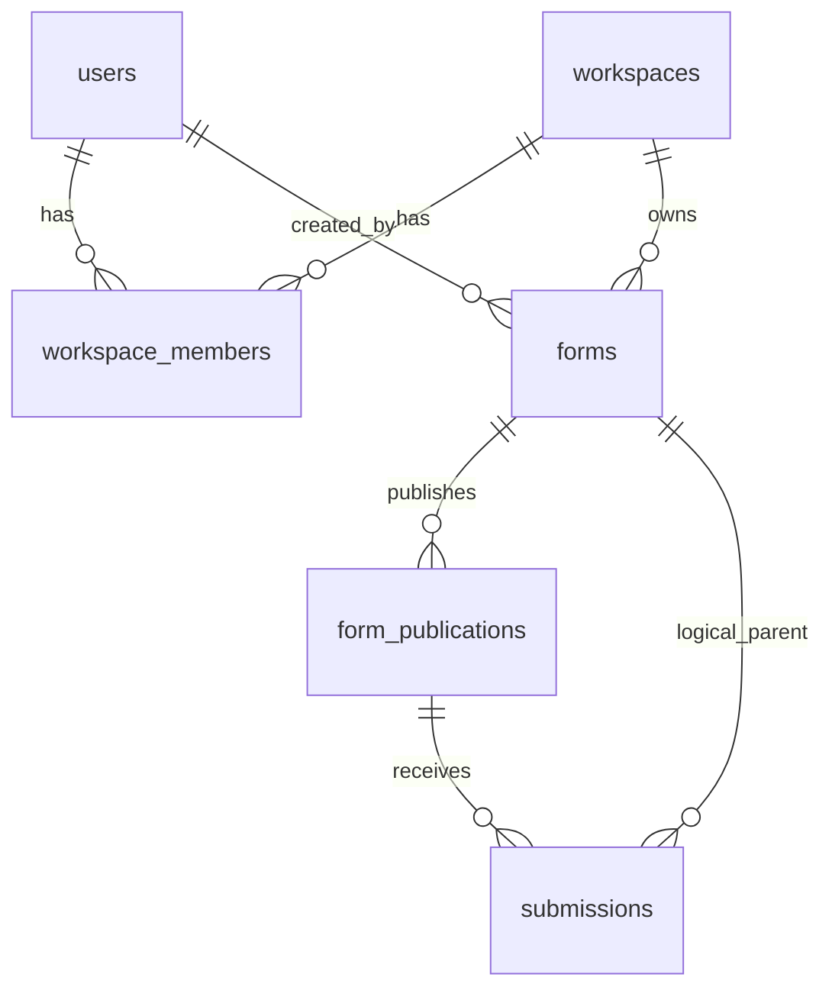

# Formvity — database tables, schema, and fields

PostgreSQL-oriented reference for a backend that matches [README-BACKEND-APIs.md](./README-BACKEND-APIs.md) and [README-USER-FEATURES.md](./README-USER-FEATURES.md). Types are illustrative; adjust naming to your conventions.

---

## Table list (MVP + common extensions)

| # | Table | Purpose |
|---|--------|---------|
| 1 | [`users`](#1-users) | Accounts for form makers. |
| 2 | [`workspaces`](#2-workspaces) | Tenant / org bucket for forms and billing. |
| 3 | [`workspace_members`](#3-workspace_members) | Who belongs to a workspace and their role. |
| 4 | [`forms`](#4-forms) | One row per form; stores **draft** PageDef JSON. |
| 5 | [`form_publications`](#5-form_publications) | Published snapshots: **slug**, version, **published** JSON (sanitized). |
| 6 | [`submissions`](#6-submissions) | One row per responder submit; links to publication used. |
| 7 | [`refresh_tokens`](#7-refresh_tokens) *(optional)* | Stateless JWT refresh rotation. |
| 8 | [`form_webhooks`](#8-form_webhooks) *(optional)* | Outbound webhook URL + secret per form. |
| 9 | [`form_templates`](#9-form_templates) *(optional)* | Server-side starter definitions for `templateId`. |
| 10 | [`uploads`](#10-uploads) *(optional)* | File upload tickets / object keys before submission finalizes. |

**MVP minimum:** tables **1–6** (you can defer `workspace_members` if every user has exactly one workspace and no invites—see notes under each table).

---

## Entity relationship (overview)



---

## 1. `users`

| Column | Type | Nullable | Description |
|--------|------|----------|-------------|
| `id` | `UUID` | PK | Primary key. |
| `email` | `VARCHAR(320)` | NOT NULL, UNIQUE | Login identifier; normalized lowercase. |
| `password_hash` | `VARCHAR(255)` | NOT NULL | BCrypt (or Argon2) hash; never store plaintext. |
| `display_name` | `VARCHAR(200)` | NULL | Shown in UI. |
| `created_at` | `TIMESTAMPTZ` | NOT NULL | Default `now()`. |
| `updated_at` | `TIMESTAMPTZ` | NOT NULL | Updated on profile/password change. |

**Indexes:** `UNIQUE (email)`.

---

## 2. `workspaces`

| Column | Type | Nullable | Description |
|--------|------|----------|-------------|
| `id` | `UUID` | PK | Primary key. |
| `name` | `VARCHAR(200)` | NOT NULL | Workspace display name. |
| `created_at` | `TIMESTAMPTZ` | NOT NULL | |
| `updated_at` | `TIMESTAMPTZ` | NOT NULL | |

**Notes:** Solo MVP often creates **one workspace per user** at `users` registration. Multi-tenant products add invites and multiple rows here.

**Indexes:** optional `INDEX (created_at)` for admin lists.

---

## 3. `workspace_members`

| Column | Type | Nullable | Description |
|--------|------|----------|-------------|
| `workspace_id` | `UUID` | NOT NULL, FK → `workspaces.id` | |
| `user_id` | `UUID` | NOT NULL, FK → `users.id` | |
| `role` | `VARCHAR(32)` | NOT NULL | e.g. `owner`, `editor`, `viewer`. |
| `created_at` | `TIMESTAMPTZ` | NOT NULL | When membership was granted. |

**Primary key:** `(workspace_id, user_id)`.

**Indexes:** `INDEX (user_id)` for “list my workspaces”.

**Skip for v0:** If only solo users, you can infer membership by `workspaces` + `created_by` only—add this table before team features.

---

## 4. `forms`

| Column | Type | Nullable | Description |
|--------|------|----------|-------------|
| `id` | `UUID` | PK | `formId` in APIs. |
| `workspace_id` | `UUID` | NOT NULL, FK → `workspaces.id` | Owning workspace. |
| `created_by_user_id` | `UUID` | NOT NULL, FK → `users.id` | Who created the form. |
| `title` | `VARCHAR(500)` | NOT NULL | Denormalized from PageDef for dashboard sort/search (keep in sync on save). |
| `status` | `VARCHAR(32)` | NOT NULL | e.g. `draft`, `archived`. |
| `draft_page_def` | `JSONB` | NOT NULL | Full **PageDef** as edited in the builder (includes `formSettings`, `components`, etc.). |
| `created_at` | `TIMESTAMPTZ` | NOT NULL | |
| `updated_at` | `TIMESTAMPTZ` | NOT NULL | Bump on every `PATCH`. |

**Indexes:** `INDEX (workspace_id, updated_at DESC)` for dashboard; optional `GIN (draft_page_def)` if you search inside JSON later.

---

## 5. `form_publications`

Each **publish** creates a new row (or you bump `version` on one row—both patterns work; append-only rows simplify audit).

| Column | Type | Nullable | Description |
|--------|------|----------|-------------|
| `id` | `UUID` | PK | Identifies which **schema snapshot** a submission used. |
| `form_id` | `UUID` | NOT NULL, FK → `forms.id` | Parent form. |
| `slug` | `VARCHAR(160)` | NOT NULL, UNIQUE | Public URL segment; globally unique. |
| `version` | `INT` | NOT NULL | Monotonic per `form_id` (start at 1). |
| `published_page_def` | `JSONB` | NOT NULL | **Sanitized** PageDef served by `GET /public/forms/:slug` for this version. |
| `is_current` | `BOOLEAN` | NOT NULL | At most one `true` per `form_id` for “what the slug resolves to” (alternative: resolve latest `published_at`). |
| `published_at` | `TIMESTAMPTZ` | NOT NULL | |
| `unpublished_at` | `TIMESTAMPTZ` | NULL | Set when form taken offline (optional). |

**Indexes:** `UNIQUE (slug)`; `INDEX (form_id, is_current)` where `is_current = true`; `INDEX (form_id, version DESC)`.

**API mapping:** `GET /public/forms/:slug` resolves `slug` → current publication row → returns `published_page_def`.

---

## 6. `submissions`

| Column | Type | Nullable | Description |
|--------|------|----------|-------------|
| `id` | `UUID` | PK | Submission id returned on `201`. |
| `form_id` | `UUID` | NOT NULL, FK → `forms.id` | Redundant but handy for inbox queries without join. |
| `publication_id` | `UUID` | NOT NULL, FK → `form_publications.id` | **Which published version** was used (validation + replay). |
| `respondent` | `JSONB` | NOT NULL | Intake answers; `{}` if disabled. Keys match `formSettings.respondentIntake`. |
| `answers` | `JSONB` | NOT NULL | Field id → value map for canvas components. |
| `metadata` | `JSONB` | NULL | e.g. `userAgent`, `referrer`, UTM (no raw IP if you want minimization—store hash). |
| `created_at` | `TIMESTAMPTZ` | NOT NULL | Server receive time. |

**Indexes:** `INDEX (form_id, created_at DESC)` for inbox; optional `INDEX (publication_id)`.

**API mapping:** `POST /public/forms/:slug/submissions` resolves slug → current `publication_id`, validates body against `published_page_def`, inserts here.

---

## 7. `refresh_tokens` *(optional)*

| Column | Type | Nullable | Description |
|--------|------|----------|-------------|
| `id` | `UUID` | PK | |
| `user_id` | `UUID` | NOT NULL, FK → `users.id` | |
| `token_hash` | `VARCHAR(128)` | NOT NULL | Hash of opaque refresh token (never store raw). |
| `expires_at` | `TIMESTAMPTZ` | NOT NULL | |
| `revoked_at` | `TIMESTAMPTZ` | NULL | Set on logout or rotation. |
| `created_at` | `TIMESTAMPTZ` | NOT NULL | |

**Indexes:** `INDEX (user_id)`; lookup by hash on refresh.

---

## 8. `form_webhooks` *(optional)*

| Column | Type | Nullable | Description |
|--------|------|----------|-------------|
| `form_id` | `UUID` | PK, FK → `forms.id` | One config row per form (or use separate `id` PK). |
| `url` | `TEXT` | NOT NULL | HTTPS destination (encrypt at rest in prod). |
| `secret` | `BYTEA` or `TEXT` | NOT NULL | HMAC signing secret. |
| `enabled` | `BOOLEAN` | NOT NULL | Default `true`. |
| `updated_at` | `TIMESTAMPTZ` | NOT NULL | |

---

## 9. `form_templates` *(optional)*

| Column | Type | Nullable | Description |
|--------|------|----------|-------------|
| `id` | `UUID` | PK | |
| `template_key` | `VARCHAR(64)` | NOT NULL, UNIQUE | Matches `POST …/forms` body `{ "templateId": "…" }`. |
| `name` | `VARCHAR(200)` | NOT NULL | Gallery label. |
| `description` | `TEXT` | NULL | |
| `page_def` | `JSONB` | NOT NULL | Starter PageDef copied into `forms.draft_page_def` on create. |
| `created_at` | `TIMESTAMPTZ` | NOT NULL | |

---

## 10. `uploads` *(optional)*

| Column | Type | Nullable | Description |
|--------|------|----------|-------------|
| `id` | `UUID` | PK | `uploadId` in presign flow. |
| `publication_id` or `slug` | | | Tie upload to a form context before submit finalizes. |
| `storage_key` | `VARCHAR(512)` | NULL until complete | Object key in S3/GCS. |
| `mime_type` | `VARCHAR(128)` | NOT NULL | |
| `size_bytes` | `BIGINT` | NOT NULL | |
| `status` | `VARCHAR(32)` | NOT NULL | e.g. `pending`, `complete`, `aborted`. |
| `expires_at` | `TIMESTAMPTZ` | NOT NULL | Garbage-collect abandoned uploads. |
| `created_at` | `TIMESTAMPTZ` | NOT NULL | |

*(Exact FK depends on whether uploads are allowed pre-submission only on published forms—align with your presign API.)*

---

## DDL sketch (MVP core only)

```sql
-- Simplified MVP: adjust types/constraints to taste.

CREATE TABLE users (
  id UUID PRIMARY KEY,
  email VARCHAR(320) NOT NULL UNIQUE,
  password_hash VARCHAR(255) NOT NULL,
  display_name VARCHAR(200),
  created_at TIMESTAMPTZ NOT NULL DEFAULT now(),
  updated_at TIMESTAMPTZ NOT NULL DEFAULT now()
);

CREATE TABLE workspaces (
  id UUID PRIMARY KEY,
  name VARCHAR(200) NOT NULL,
  created_at TIMESTAMPTZ NOT NULL DEFAULT now(),
  updated_at TIMESTAMPTZ NOT NULL DEFAULT now()
);

CREATE TABLE workspace_members (
  workspace_id UUID NOT NULL REFERENCES workspaces(id) ON DELETE CASCADE,
  user_id UUID NOT NULL REFERENCES users(id) ON DELETE CASCADE,
  role VARCHAR(32) NOT NULL,
  created_at TIMESTAMPTZ NOT NULL DEFAULT now(),
  PRIMARY KEY (workspace_id, user_id)
);

CREATE TABLE forms (
  id UUID PRIMARY KEY,
  workspace_id UUID NOT NULL REFERENCES workspaces(id) ON DELETE CASCADE,
  created_by_user_id UUID NOT NULL REFERENCES users(id),
  title VARCHAR(500) NOT NULL,
  status VARCHAR(32) NOT NULL DEFAULT 'draft',
  draft_page_def JSONB NOT NULL,
  created_at TIMESTAMPTZ NOT NULL DEFAULT now(),
  updated_at TIMESTAMPTZ NOT NULL DEFAULT now()
);

CREATE INDEX forms_workspace_updated ON forms (workspace_id, updated_at DESC);

CREATE TABLE form_publications (
  id UUID PRIMARY KEY,
  form_id UUID NOT NULL REFERENCES forms(id) ON DELETE CASCADE,
  slug VARCHAR(160) NOT NULL UNIQUE,
  version INT NOT NULL,
  published_page_def JSONB NOT NULL,
  is_current BOOLEAN NOT NULL DEFAULT false,
  published_at TIMESTAMPTZ NOT NULL DEFAULT now(),
  unpublished_at TIMESTAMPTZ
);

CREATE UNIQUE INDEX one_current_per_form ON form_publications (form_id) WHERE is_current;

CREATE TABLE submissions (
  id UUID PRIMARY KEY,
  form_id UUID NOT NULL REFERENCES forms(id) ON DELETE CASCADE,
  publication_id UUID NOT NULL REFERENCES form_publications(id),
  respondent JSONB NOT NULL DEFAULT '{}',
  answers JSONB NOT NULL,
  metadata JSONB,
  created_at TIMESTAMPTZ NOT NULL DEFAULT now()
);

CREATE INDEX submissions_form_created ON submissions (form_id, created_at DESC);
```

**Note:** `UNIQUE (form_id) WHERE is_current` works in PostgreSQL for “only one current publication per form” if you flip `is_current` inside a transaction on republish.

---

## Related docs

- [README-BACKEND-APIs.md](./README-BACKEND-APIs.md) — API build order and endpoints.
- [README-USER-FEATURES.md](./README-USER-FEATURES.md) — Product flows.
